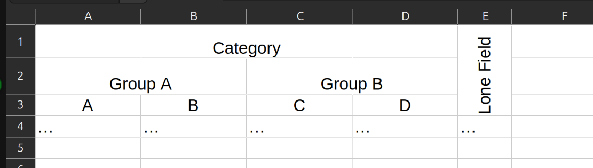

# pyxlmapper
This library can help reading and mapping hierarchical .xlsx spreadsheets like this one:


into data such as:
```json
[
  {
    "category": {
      "group_a": {
        "a": "...",
        "b": "..."
      },
      "group_b": {
        "c": "...",
        "d": "...",
      }
    },
    "lone_field": "...",
  },
  ...
]
```

Or this:
```json
[
  {
    "category.group_a.a": "...",
    "category.group_a.b": "...",
    "category.group_b.c": "...",
    "category.group_b.d": "...",
    "lone_field": "...",
  },
  ...
]
```

# Installation
WARNING: `PyPI` has no package yet. Name clame is pending: https://github.com/pypi/support/issues/5471
```sh
pip install pyxlmapper
```

# Usage
You can write your own mapper or use code generation to infer mapper automatically

## Writing and using mapper
`pyxlmapper` uses DSL based on python classes. First, you need to define a mapper class that
inherits `SpreadsheetMapper`. And then define all headers. Class nesting is resambling headers nesting
in the spreadsheet. You do not need to specify offsets manually, it will be calculated automatically,
considering that header are nested from top to bottom and column order is from left to right without gaps
(by default, but could be modified). For the example from above, the mapper would look like this:

```python
import json
import openpyxl
from pyxlmapper import SpreadsheetMapper


class Mapper(SpreadsheetMapper):
    class Category:
        class GroupA:
            class A:
                pass

            class B:
                pass

        class GroupB:
            class C:
                pass

            class D:
                pass

    class LoneField:
        pass


# Open spreadhseet:
wb = openpyxl.open('data.xlsx', data_only=True)
ws = wb['sheet name']  # or ws.active for the first one

# instantiate mapper:
mapper = Mapper()

data = []

for row in mapper.map_rows(ws, start_at=3):
    print(row)
    # OR
    data.append(row)

# Save a file
with open('output.json', 'w') as fd:
    fd.write(json.dump(data, fd))
```

## Syntax
### Class name
Class names are used to automaticaly derive `input_name` and `output_name` if not provided.
`input_name` would be derived as such: `SomeFieldName` into `Some Field Name`. `output_name` on the
other hand would be derived as `some_field_name`.

### `output_name` (str)
If specified, used as an override for the name of the field in the output JSON file.

Example:
```python
class Mapper(SpreadsheetMapper):
    class SomeField:
        output_name = "other_name"
```

### `input_name` (str)
If specified, used as an override for the column name in the xlsx spreadsheet.

Example:
```python
class Mapper(SpreadsheetMapper):
    class SomeField:
        input_name = "You can use ::any:: symbols"
```

### `offset` tuple[int, int]
Specifies an offset, relative to default position. Useful when some column or row is skipped

Format: `offset = (v_offset: int, h_offset: int)`

```python
class Mapper(SpreadsheetMapper):
    class SomeField:
        offset = (0, 1)  # To skip a column
```
